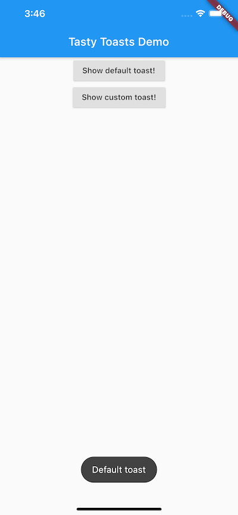
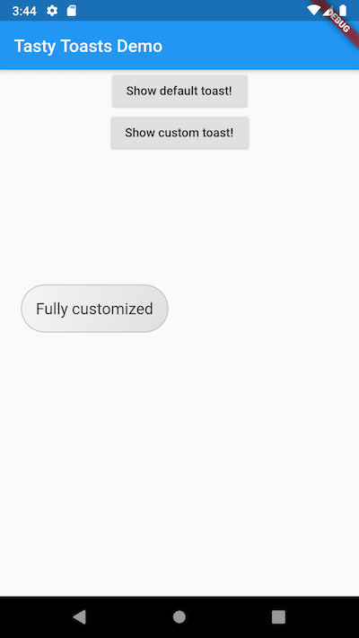

# tasty_toast

A simple package which shows a toast on the screen. By default bottomCenter, but using `Alignment` you can place it anywhere.
I've created this package because I was looking for something similar, but didn't like how other packages handled my (simple) usecase.

You can easily customize the toast by providing a `TextStyle` for the text or `BoxDecoration` for the background.

! You will need a `context`.

## Getting Started

#### Import tasty toast:
```dart
import 'package:tasty_toast/tasty_toast.dart';
```

#### Call `showToast` with the context variable:
```dart
showToast(
  context,
  "Some message!",
);
```
This will use the defaults, which is a dark toast, white letters and shows at the `bottomCenter`.

#### Optionally customize the toast:

```dart
showToast(
  context,
  "Fully customized",

  // Optional parameters:
  alignment: Alignment.centerLeft,
  textStyle: customTextStyle,
  background: customBoxDecoration,
  duration: Duration(seconds: 5),
  padding: EdgeInsets.all(25.0),
  offsetAnimationStart: Offset(-0.1, -0.1),  // Defines the starting position of the fly-in animation
);
```

# Screenshots

Here two screenshots for iOS / Android, of course you can show the default or customize the toasts on both devices.

#### iOS screenshot with default settings:


#### Android screenshot with customized parameters:


